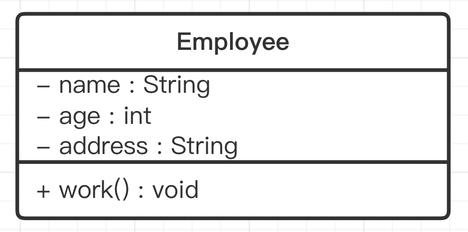
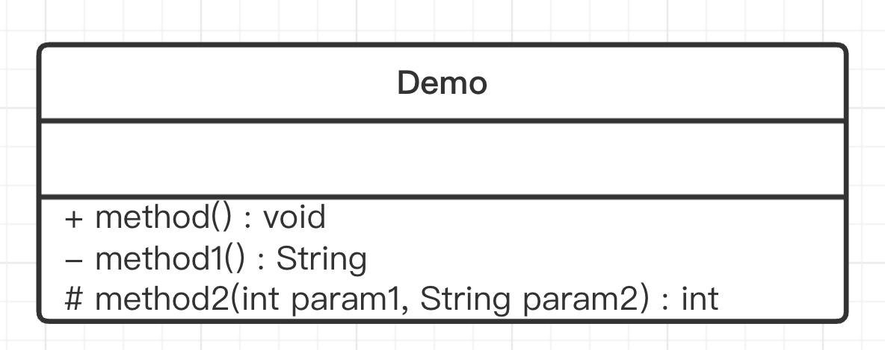

# UML统一建模语言

## 1、概述

统一建模语言（Unified Modeling Language，UML）是用来设计软件的可视化建模语言。它的特点是简单、统一、图形化、能表达软件设计中的动态与静态信息。

UML 从目标系统的不同角度出发，定义了用例图、类图、对象图、状态图、活动图、时序图、协作图、构件图、部署图等 9 种图。

## 2、类图概述

类图(Class diagram)是显示了模型的静态结构，特别是模型中存在的类、类的内部结构以及它们与其他类的关系等。类图不显示暂时性的信息。类图是面向对象建模的主要组成部分。

## 3、类图的作用

在软件工程中，类图是一种静态的结构图，描述了系统的类的集合，类的属性和类之间的关系，可以简化了人们对系统的理解；

类图是系统分析和设计阶段的重要产物，是系统编码和测试的重要模型。

## 4、类图表示法

### 4.1 类的表示方式

在UML类图中，类使用包含类名、属性(field) 和方法(method) 且带有分割线的矩形来表示，比如下图表示一个Employee类，它包含name,age和address这3个属性，以及work()方法。 

属性/方法名称前加的加号和减号表示了这个属性/方法的可见性，UML类图中表示可见性的符号有三种：

- \+ 表示 public
- \- 表示 private
- \# 表示 protected

属性的完整表示方式是： **可见性 名称 ：类型 [ = 缺省值]**  

方法的完整表示方式是： **可见性 名称(参数列表) [ ：返回类型]**

> 注意:
> 
> 1、中括号中的内容表示是可选的
> 
> 2、也有将类型放在变量名前面，返回值类型放在方法名前面

**举个例子**

上图Demo类定义了三个方法：

