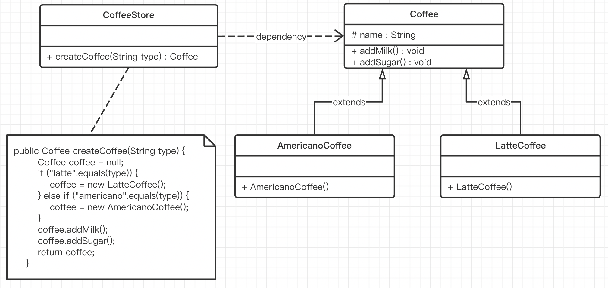
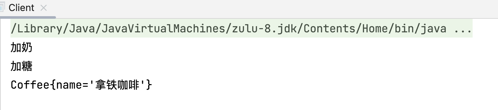
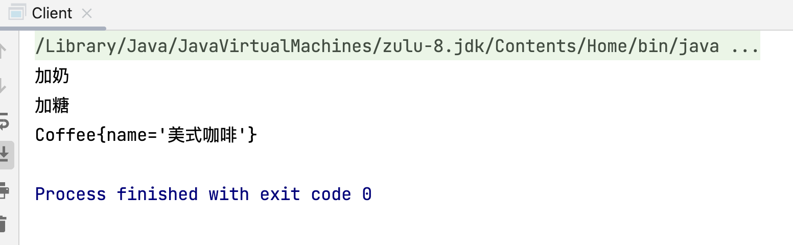
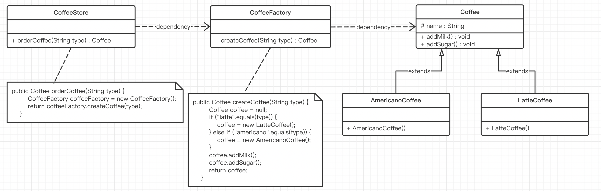

# 简单工厂（Simple Factory）

## 一、简介

### 1.1 简单工厂的概述

简单工厂不是设计模式，更像是一种编程习惯。它把实例化的操作单独放到一个类中，这个类就成为简单工厂类，让简单工厂类来决定应该用哪个具体子类来实例化。

### 1.2 简单工厂的结构

简单工厂包含如下角色：

* 抽象产品 ：定义了产品的规范【Java语言中的规范要么是接口、要么就是抽象类】，描述了产品的主要特性和功能。
* 具体产品 ：实现或者继承抽象产品的子类。
* 具体工厂 ：提供了创建产品的方法，调用者通过该方法来获取产品。

## 二、简单工厂实现

### 2.1 案例1

#### 类图



#### 代码实现

Coffee类：

```java
// Coffee 咖啡抽象类
public abstract class Coffee {

    // 咖啡名称
    protected String name;

    // 加奶
    public void addMilk() {
        System.out.println("加奶");
    }

    // 加糖
    public void addSugar() {
        System.out.println("加糖");
    }

    // toString方法，格式化一下字符串对象形式
    @Override
    public String toString() {
        return "Coffee{" +
                "name='" + name + '\'' +
                '}';
    }
}
```

LatteCoffee类：

```java
// LatteCoffee 拿铁咖啡类
public class LatteCoffee extends Coffee {

    // 使用构造的方式给成员变量赋值
    public LatteCoffee() {
        super.name = "拿铁咖啡";
    }
}
```

AmericanoCoffee类：

```java
// AmericanoCoffee 美式咖啡类
public class AmericanoCoffee extends Coffee {

    // 使用构造的方式给成员变量赋值
    public AmericanoCoffee() {
        super.name = "美式咖啡";
    }
}
```

CoffeeStore类：

```java
// CoffeeStore 咖啡店店类
public class CoffeeStore {

    /**
     * 根据咖啡类型创建咖啡
     * @param type 咖啡类型【latte、americano】
     * @return
     */
    public Coffee createCoffee(String type) {
        Coffee coffee = null;
        if ("latte".equals(type)) {
            coffee = new LatteCoffee();
        } else if ("americano".equals(type)) {
            coffee = new AmericanoCoffee();
        }
        // 加配料
        coffee.addMilk();
        coffee.addSugar();
        return coffee;
    }
}
```

客户端（使用方或者称为调用方）

```java
public class Client {
    public static void main(String[] args) {
        // 创建一个咖啡店对象
        CoffeeStore coffeeStore = new CoffeeStore();
        // 根据入参咖啡类型创建咖啡
        Coffee coffee = coffeeStore.createCoffee("latte");
        // Coffee coffee = coffeeStore.createCoffee("americano");
        System.out.println(coffee);
    }
}
```

运行结果：





### 2.2 案例1（改造）

#### 类图



#### 代码实现

Coffee类：

```java
// Coffee 咖啡抽象类
public abstract class Coffee {

    // 咖啡名称
    protected String name;

    // 加奶
    public void addMilk() {
        System.out.println("加奶");
    }

    // 加糖
    public void addSugar() {
        System.out.println("加糖");
    }

    // toString方法，格式化一下字符串对象形式
    @Override
    public String toString() {
        return "Coffee{" +
                "name='" + name + '\'' +
                '}';
    }
}
```

LatteCoffee类：

```java
// LatteCoffee 拿铁咖啡类
public class LatteCoffee extends Coffee {

    // 使用构造的方式给成员变量赋值
    public LatteCoffee() {
        super.name = "拿铁咖啡";
    }
}
```

AmericanoCoffee类：

```java
// AmericanoCoffee 美式咖啡类
public class AmericanoCoffee extends Coffee {

    // 使用构造的方式给成员变量赋值
    public AmericanoCoffee() {
        super.name = "美式咖啡";
    }
}
```

CoffeeFactory类：

```java
// CoffeeFactory 咖啡工厂类
public class CoffeeFactory {

    /**
     * 根据咖啡类型创建咖啡
     * @param type 咖啡类型【latte、americano】
     * @return Coffee子类对象
     */
    public Coffee createCoffee(String type) {
        Coffee coffee = null;
        if ("latte".equals(type)) {
            coffee = new LatteCoffee();
        } else if ("americano".equals(type)) {
            coffee = new AmericanoCoffee();
        }
        // 加配料
        coffee.addMilk();
        coffee.addSugar();
        return coffee;
    }
}
```

CoffeeStore类：

```java
// CoffeeStore 咖啡店类
public class CoffeeStore {

    /**
     * 创建咖啡
     * @param type 咖啡类型【latte、americano】
     * @return Coffee子类对象
     */
    public Coffee orderCoffee(String type) {
        // 创建咖啡工厂对象
        CoffeeFactory coffeeFactory = new CoffeeFactory();
        // 调用生产咖啡方法
        return coffeeFactory.createCoffee(type);
    }
}
```

客户端（使用方或者称为调用方）

```java
// Client 客户端
public class Client {
    public static void main(String[] args) {
        // 创建一个咖啡店对象
        CoffeeStore coffeeStore = new CoffeeStore();
        // 根据入参咖啡类型创建咖啡
        // Coffee coffee = coffeeStore.orderCoffee("latte");
        Coffee coffee = coffeeStore.orderCoffee("americano");
        System.out.println(coffee);
    }
}
```

工厂（CoffeeFactory）处理创建对象的细节，一旦有了CoffeeFactory，CoffeeStore类中的createCoffee()就变成此对象的客户，后期如果需要Coffee对象直接从工厂中获取即可。这样也就解除了和Coffee实现类的耦合，同时又产生了新的耦合，CoffeeStore对象和CoffeeFactory工厂对象的耦合，工厂对象和商品对象的耦合。

后期如果再加新品种的咖啡，我们势必要需求修改CoffeeFactory的代码，违反了开闭原则。工厂类的客户端可能有很多，比如创建美团外卖等，这样只需要修改工厂类的代码，省去其他的修改操作。

### 2.3 简单工厂总结

**优点：**

封装了创建对象的过程，可以通过参数直接获取对象。把对象的创建和业务逻辑层分开，这样以后就避免了修改客户代码，如果要实现新产品直接修改工厂类，而不需要在原代码中修改，这样就降低了客户代码修改的可能性，更加容易扩展。

**缺点：**

增加新产品时还是需要修改工厂类的代码，违背了“开闭原则”。

### 2.4 扩展（静态工厂）

在开发中也有一部分人将工厂类中的创建对象的功能定义为静态的，这个就是静态工厂模式，它也不是23种设计模式中的。代码如下：

CoffeeFactory类：

```java
// CoffeeFactory 咖啡工厂类
public class CoffeeFactory {

    /**
     * 根据咖啡类型创建咖啡
     * @param type 咖啡类型【latte、americano】
     * @return Coffee子类对象
     */
    public static Coffee createCoffee(String type) {
        Coffee coffee = null;
        if ("latte".equals(type)) {
            coffee = new LatteCoffee();
        } else if ("americano".equals(type)) {
            coffee = new AmericanoCoffee();
        }
        // 加配料
        coffee.addMilk();
        coffee.addSugar();
        return coffee;
    }
}
```

CoffeeStore类：

```java
// CoffeeStore 咖啡店类
public class CoffeeStore {

    /**
     * 创建咖啡
     * @param type 咖啡类型【latte、americano】
     * @return Coffee子类对象
     */
    public Coffee orderCoffee(String type) {
        // 创建咖啡工厂对象
        // CoffeeFactory coffeeFactory = new CoffeeFactory();
        // 调用生产咖啡方法
        // return coffeeFactory.createCoffee(type);

        // 由于CoffeeFactory是静态工厂，可以直接通过类名调用
        return CoffeeFactory.createCoffee(type);
    }
}
```

客户端（使用方或者称为调用方）

```java
// Client 客户端
public class Client {
    public static void main(String[] args) {
        // 创建一个咖啡店对象
        CoffeeStore coffeeStore = new CoffeeStore();
        // 根据入参咖啡类型创建咖啡
        // Coffee coffee = coffeeStore.orderCoffee("latte");
        Coffee coffee = coffeeStore.orderCoffee("americano");
        System.out.println(coffee);
    }
}
```

