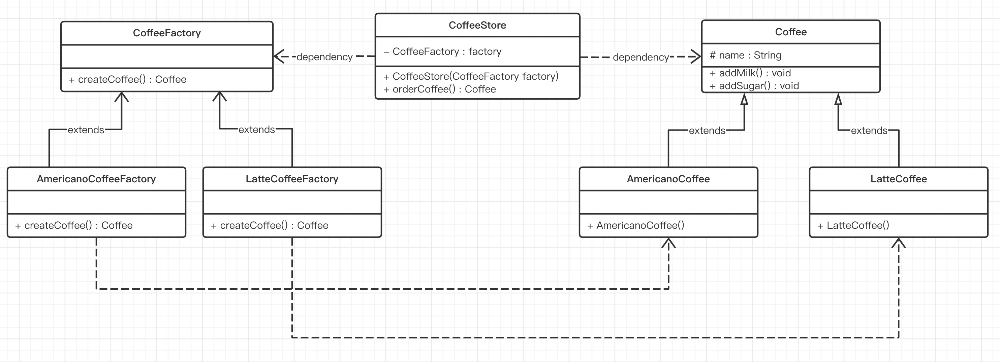
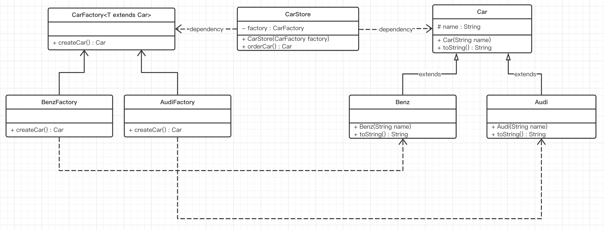

# 工厂方法模式（Factory Method）

## 一、简介

### 1.1 概述

针对简单工厂的缺点，使用工厂方法模式就可以完美的解决，完全遵循开闭原则。

### 1.2 概念

定义一个用于创建对象的接口，让子类决定实例化哪个产品类对象。工厂方法使一个产品类的实例化延迟到其工厂的子类。

### 1.3 工厂方法模式结构

工厂方法模式的主要角色：

* 抽象工厂（Abstract Factory）：提供了创建产品的接口，调用者通过它访问具体工厂的工厂方法来创建产品。
* 具体工厂（ConcreteFactory）：主要是实现抽象工厂中的抽象方法，完成具体产品的创建。
* 抽象产品（Product）：定义了产品的规范【Java中的规范要么是接口要么就是抽象类】，描述了产品的主要特性和功能。
* 具体产品（ConcreteProduct）：实现了抽象产品角色所定义的接口，由具体工厂来创建，它同具体工厂之间一一对应。

## 二、工厂方法模式实现

### 2.1 案例1

#### 类图



#### 代码实现

抽象产品

Coffee抽象类：

```java
// Coffee 咖啡抽象类
public abstract class Coffee {

    // 咖啡名称
    protected String name;

    // 加奶
    public void addMilk() {
        System.out.println("加奶");
    }

    // 加糖
    public void addSugar() {
        System.out.println("加糖");
    }

    // toString方法，格式化一下字符串对象形式
    @Override
    public String toString() {
        return "Coffee{" +
                "name='" + name + '\'' +
                '}';
    }
}
```

具体产品

AmericanoCoffee类：

```java
// AmericanoCoffee 美式咖啡类
public class AmericanoCoffee extends Coffee {

    // 使用构造的方式给成员变量赋值
    public AmericanoCoffee() {
        super.name = "美式咖啡";
    }
}
```

LatteCoffee类：

```java
// LatteCoffee 拿铁咖啡类
public class LatteCoffee extends Coffee {

    // 使用构造的方式给成员变量赋值
    public LatteCoffee() {
        super.name = "拿铁咖啡";
    }
}
```

抽象工厂

CoffeeFactory接口：

```java
// CoffeeFactory 咖啡工厂接口
public interface CoffeeFactory {

    // 生产咖啡
    Coffee createCoffee();
}
```

具体工厂

LatteCoffeeFactory类：

```java
// 拿铁咖啡工厂，专门用于拿铁咖啡的生产
public class LatteCoffeeFactory implements CoffeeFactory {

    // 生产拿铁咖啡
    @Override
    public Coffee createCoffee() {
        return new LatteCoffee();
    }
}
```

LatteCoffeeFactory类：

```java
// 拿铁咖啡工厂，专门用于拿铁咖啡的生产
public class LatteCoffeeFactory implements CoffeeFactory {

    // 生产拿铁咖啡
    @Override
    public Coffee createCoffee() {
        return new LatteCoffee();
    }
}
```

咖啡店

CoffeeStore类：

```java
// CoffeeStore 咖啡店类
public class CoffeeStore {

    /** 定义咖啡工厂成员变量 */
    private CoffeeFactory factory;

    /**
     * 使用构造函数的方式注入咖啡工厂成员变量
     * 
     * @param factory 咖啡工厂接口实现类对象
     */
    public CoffeeStore(CoffeeFactory factory) {
        this.factory = factory;
    }

    /**
     * 制造咖啡
     *
     * @return Coffee抽象类的具体实现类的对象
     */
    public Coffee orderCoffee() {
        Coffee coffee = factory.createCoffee();
        // 咖啡配料
        coffee.addSugar();
        coffee.addMilk();
        return coffee;
    }
}
```

客户端（使用方或者称为调用方）

```java
// Client 客户端
public class Client {
    public static void main(String[] args) {
        // 创咖啡工厂使用多态的方式
        // CoffeeFactory coffeeFactory = new AmericanoCoffeeFactory(); // 美式咖啡工厂
        CoffeeFactory coffeeFactory = new LatteCoffeeFactory(); // 拿铁咖啡工厂
        // 创建咖啡店对象，咖啡店对象构造需要指定一个咖啡工厂
        CoffeeStore coffeeStore = new CoffeeStore(coffeeFactory);
        // 咖啡店制作出来的咖啡
        Coffee coffee = coffeeStore.orderCoffee();
        System.out.println(coffee);
    }
}
```

从以上的编写的代码可以看到，要增加产品类时也要相应地增加工厂类，不需要修改工厂类的代码了，这样就解决了简单工厂模式的缺点。

工厂方法模式是简单工厂模式的进一步抽象。由于使用了多态性，工厂方法模式保持了简单工厂模式的优点，而且克服了它的缺点。

### 2.2 案例2

#### 类图



#### 代码实现

抽象产品

Car抽象类：

```java
// Car 车抽象类
public abstract class Car {

    private String name;

    public Car(String name) {
        this.name = name;
    }

    // 输出一下车的信息
    @Override
    public String toString() {
        return name + "@" + hashCode();
    }
}
```

具体产品

Benz类：

```java
// Benz 奔驰车类
public class Benz extends Car {

    // 调用父类的构造
    public Benz(String name) {
        super(name);
    }
}
```

Audi类：

```java
// Audi 奥迪车类
public class Audi extends Car {

    // 调用父类的构造
    public Audi(String name) {
        super(name);
    }
}
```

抽象工厂

CarFactory抽象类：

```java
// CarFactory 车抽象类工厂
public abstract class CarFactory<T extends Car> {  //将车类工厂抽象为抽象类，添加泛型T由子类指定车类类型

    public abstract Car createCar();
}
```

具体工厂

BenzFactory类：

```java
// BenzFactory 奔驰车工厂
public class BenzFactory extends CarFactory<Benz> { //将奔驰车类工厂抽象为抽象类，添加泛型T由子类指定奔驰车类类型

    // 生产奔驰车
    @Override
    public Car createCar() {
        return new Benz("奔驰车");
    }
}
```

AudiFactory类：

```java
// AudiFactory 奥迪车工厂
public class AudiFactory extends CarFactory<Audi> { //将奥迪车类工厂抽象为抽象类，添加泛型T由子类指定奥迪车类类型

    // 生产奥迪车
    @Override
    public Car createCar() {
        return new Audi("奥迪车");
    }
}
```

汽车店类

CarStore类：

```java
// CarStore 汽车店类
public class CarStore {

    /** 定义汽车工厂成员变量 */
    private CarFactory factory;

    /**
     * 构造函数的方式注入汽车工厂成员变量
     *
     * @param factory 汽车工厂
     */
    public CarStore(CarFactory factory) {
        this.factory = factory;
    }

    /**
     * 从工厂获取到汽车进行销售
     *
     * @return Car抽象类的实现类对象
     */
    public Car orderCar() {
        return factory.createCar();
    }
}
```

客户端（使用方或者称为调用方）

```java
// Client 客户端
public class Client {
    public static void main(String[] args) {
        // 多态的方式创建奥迪汽车工厂
        CarFactory audiFactory = new AudiFactory();
        // 创建汽车店对象，汽车店需要从工厂拿到汽车
        CarStore carStore = new CarStore(audiFactory);
        Car car = carStore.orderCar();
        System.out.println(car);
    }
}
```

这样，我们就可以根据不同类型的工厂生产不同类型的车，并且新增一个新品牌的车，只需要定义好一个新的具体产品，然后再创建一个新品牌车的工厂即可。

## 三、工厂方法模式总结

**优点：**

- 用户只需要知道具体工厂的名称就可得到所要的产品，无须知道产品的具体创建过程；
- 在系统增加新的产品时只需要添加具体产品类和对应的具体工厂类，无须对原工厂进行任何修改，满足开闭原则；

**缺点：**

* 每增加一个产品就要增加一个具体产品类和一个对应的具体工厂类，这增加了系统的复杂度。

