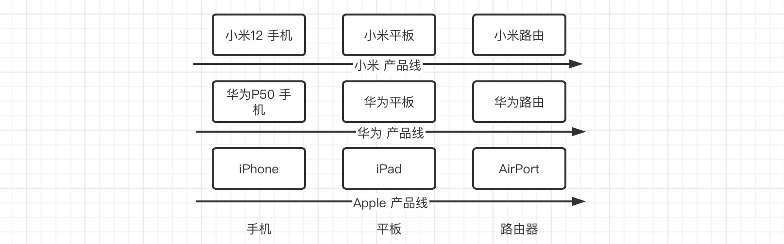
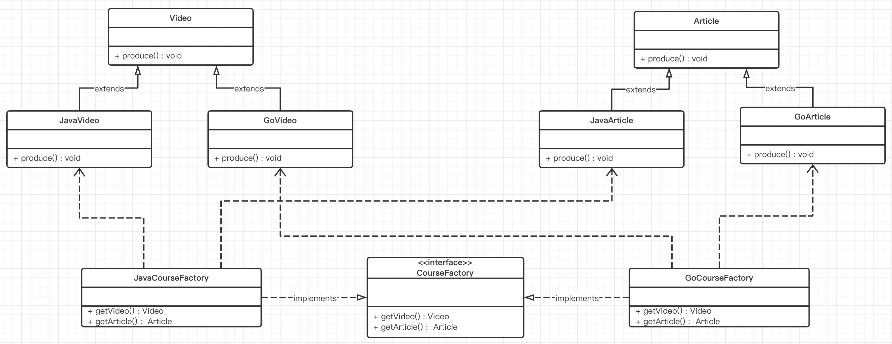

# 抽象工厂模式（Abstract Factory）

## 一、简介

### 1.1 概述

工厂方法模式，通过定义顶层抽象工厂类，通过继承的方式，针对于每一个具体产品都提供一个具体工厂类用于创建。

抽象工厂模式是一种为访问类提供一个创建一组相关或相互依赖对象的接口，且访问类无须指定所要产品的具体类就能得到同族的不同等级的产品的模式结构。

抽象工厂模式是工厂方法模式的升级版本，工厂方法模式只生产一个等级的产品，而抽象工厂模式可生产多个等级的产品。

### 1.2 抽象工厂模式结构

抽象工厂模式的主要角色如下：

* 抽象工厂（Abstract Factory）：提供了创建产品的接口，它包含多个创建产品的方法，可以创建多个不同等级的产品。
* 具体工厂（Concrete Factory）：主要是实现抽象工厂中的多个抽象方法，完成具体产品的创建。
* 抽象产品（Product）：定义了产品的规范，描述了产品的主要特性和功能，抽象工厂模式有多个抽象产品。
* 具体产品（ConcreteProduct）：实现了抽象产品角色所定义的接口，由具体工厂来创建，它 同具体工厂之间是多对一的关系。

## 二、抽象工厂模式实现

### 2.1 案例1

#### 类图

#### 代码实现

### 2.2 案例2

#### 类图

#### 代码实现

## 三、抽象工厂模式总结

**优点：**

具体产品在应用层代码隔离，无须关心创建细节。

将一个系列的产品族统一到一起创建。

**缺点：**

规定了所有可能被创建的产品的集合，产品族中扩展新的产品困难，需要修改抽象工厂的接口。

增加了系统的抽象性和理解难度。

## 四、抽象工厂模式使用场景

* 当需要创建的对象是一系列相互关联或相互依赖的产品族时，如电器工厂中的电视机、洗衣机、空调等。

* 系统中有多个产品族，但每次只使用其中的某一族产品。如有人只喜欢穿某一个品牌的衣服和鞋。

* 系统中提供了产品的类库，且所有产品的接口相同，客户端不依赖产品实例的创建细节和内部结构。

如：输入法换皮肤，一整套一起换。生成不同操作系统的程序。

