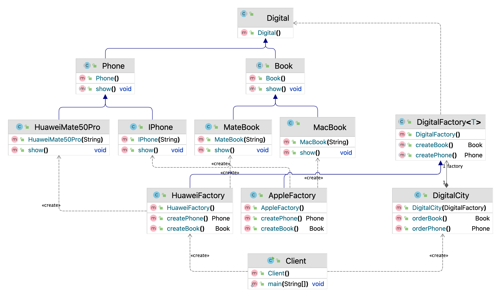

# 抽象工厂模式（Abstract Factory）

## 一、简介

### 1.1 概述

工厂方法模式，通过定义顶层抽象工厂类，通过继承的方式，针对于每一个具体产品都提供一个具体工厂类用于创建。

抽象工厂模式是一种为访问类提供一个创建一组相关或相互依赖对象的接口，且访问类无须指定所要产品的具体类就能得到同族的不同等级的产品的模式结构。

抽象工厂模式是工厂方法模式的升级版本，工厂方法模式只生产一个等级的产品，而抽象工厂模式可生产多个等级的产品。


### 1.2 抽象工厂模式结构

抽象工厂模式的主要角色如下：

* 抽象工厂（Abstract Factory）：提供了创建产品的接口，它包含多个创建产品的方法，可以创建多个不同等级的产品。
* 具体工厂（Concrete Factory）：主要是实现抽象工厂中的多个抽象方法，完成具体产品的创建。
* 抽象产品（Product）：定义了产品的规范，描述了产品的主要特性和功能，抽象工厂模式有多个抽象产品。
* 具体产品（ConcreteProduct）：实现了抽象产品角色所定义的接口，由具体工厂来创建，它 同具体工厂之间是多对一的关系。

## 二、抽象工厂模式实现

### 2.1 案例1

案例说明：视频和文章可以看一类产品【都是课程需要用到的】，从而抽象出视频和文章抽象类，然后Java视频类和Go视频类继承视频抽象类，Java技术文章类和Go技术文章类继承文章抽象类。定义抽象工厂专门生产视频和文章抽象类的子类对象这里只的是课程类工厂接口，从而就有了Java课程工厂接口和Go课程工厂接口。

#### 类图


#### 代码实现

抽象产品

Video抽象类：

```java
// Video 视频抽象类
public abstract class Video {

    // 生产视频
    public abstract void produce();
}
```

Article抽象类：

```java
// Article 文章抽象类
public abstract class Article {

    // 生产文章
    public abstract void produce();
}
```

具体产品

JavaVideo类：

```java
// JavaVideo Java语言技术视频类
public class JavaVideo extends Video {

    @Override
    public void produce() {
        System.out.println("Java语言技术视频");
    }
}
```

GoVideo类：

```java
// GoVideo Go语言技术视频类
public class GoVideo extends Video {

    @Override
    public void produce() {
        System.out.println("Go语言技术视频");
    }
}
```

GoArticle类：

```java
// GoArticle Go语言技术文章类
public class GoArticle extends Article {

    @Override
    public void produce() {
        System.out.println("Go语言技术文章");
    }
}
```

JavaArticle类：

```java
// JavaArticle Java技术文章类
public class JavaArticle extends Article {
    @Override
    public void produce() {
        System.out.println("Java语言技术文章");
    }
}
```

抽象工厂

CourseFactory类：

```java
// CourseFactory 课程工厂接口
public interface CourseFactory {

    // 获取视频
    Video getVideo();

    // 获取文章
    Article getArticle();
}
```

GoCourseFactory类：

```java
// GoCourseFactory Go语言课程工厂
public class GoCourseFactory implements CourseFactory {

    @Override
    public Video getVideo() {
        return new GoVideo();
    }

    @Override
    public Article getArticle() {
        return new GoArticle();
    }
}
```

JavaCourseFactory类：

```java
// JavaCourseFactory Java语言课程工厂
public class JavaCourseFactory implements CourseFactory {

    @Override
    public Video getVideo() {
        return new JavaVideo();
    }

    @Override
    public Article getArticle() {
        return new JavaArticle();
    }
}
```

客户端（使用方或者称为调用方）

```java
// Client 客户端
public class Client {
    public static void main(String[] args) {
        // Java
        // CourseFactory courseFactory = new JavaCourseFactory();
        // Go
        CourseFactory courseFactory = new GoCourseFactory();
        Video video = courseFactory.getVideo();
        Article article = courseFactory.getArticle();
        video.produce();
        article.produce();
    }
}
```

如果要加同一个产品族的话，只需要再加一个对应的工厂类即可，不需要修改其他的类。

### 2.2 案例2

#### 类图



#### 代码实现

抽象产品

Digital抽象类：

```java
// Digital 数码产品抽象类
public abstract class Digital {


}
```

Book抽象类：

```java
// Book 笔记本电脑抽象类
public abstract class Book extends Digital {

    /** 名称 */
    protected String name;

    /** 基本打印信息 */
    public abstract void show();
}
```

Phone抽象类：

```java
// Phone 手机抽象类
public abstract class Phone extends Digital {

    /** 名称 */
    protected String name;

    /** 基本打印信息 */
    public abstract void show();
}
```

具体产品

IPhone类：

```java
// IPhone 苹果手机
public class IPhone extends Phone {

    public IPhone(String name) {
        super.name = name;
    }

    @Override
    public void show() {
        System.out.println(this.name + "@" + this.hashCode());
    }
}
```

HuaweiMate50Pro类：

```java
// HuaweiMate50Pro 华为手机Mate50Pro
public class HuaweiMate50Pro extends Phone {

    public HuaweiMate50Pro(String name) {
        super.name = name;
    }

    @Override
    public void show() {
        System.out.println(this.name + "@" + this.hashCode());
    }
}
```

MacBook类：

```java
// MacBook MacBook笔记本
public class MacBook extends Book {

    public MacBook(String name) {
        super.name = name;
    }

    @Override
    public void show() {

    }
}
```

MateBook类：

```java
// MateBook 华为笔记本电脑
public class MateBook extends Book {

    public MateBook(String name) {
        super.name = name;
    }

    @Override
    public void show() {
        System.out.println(this.name + "@" + this.hashCode());
    }
}
```

抽象工厂

DigitalFactory类：这里的数码工厂同时生产同产品族的产品【产品族：手机、耳机、平板电脑、台式机、相机等这都是同一族的数码产品】

```java
// DigitalFactory 数码产品工厂
public abstract class DigitalFactory<T extends Digital> {

    /** 生产手机 */
    public abstract Phone createPhone();

    /** 生产笔记本电脑 */
    public abstract Book createBook();
}
```

AppleFactory类：

```java
// AppleFactory Apple数码工厂
public class AppleFactory extends DigitalFactory<Digital> {

    @Override
    public Phone createPhone() {
        return new IPhone("iphone 14 Pro Max");
    }

    @Override
    public Book createBook() {
        return new MacBook("MacBook Pro 2022");
    }
}
```

HuaweiFactory类：

```java
// HuaweiFactory 华为数码工厂
public class HuaweiFactory extends DigitalFactory<Digital> {

    @Override
    public Phone createPhone() {
        return new HuaweiMate50Pro("Huawei Mate50 Pro");
    }

    @Override
    public Book createBook() {
        return new MateBook("Huawei MateBook 2022");
    }
}
```

数码城

DigitalCity类：可以通过抽象工厂多态的方式使用Huawei的数码工厂或者是Apple的数码工厂。

```java
// DigitalCity 数码城
public class DigitalCity {

    // 数码工厂
    private DigitalFactory factory;

    // 构造函数的方式注入数码工厂
    public DigitalCity(DigitalFactory factory) {
        this.factory = factory;
    }

    // 购买笔记本电脑
    public Book orderBook() {
        return factory.createBook();
    }

    // 购买手机
    public Phone orderPhone() {
        return factory.createPhone();
    }
}
```

客户端（使用方或者称为调用方）

```java
// Client 客户端
public class Client {
    public static void main(String[] args) {
        // 购买Apple产品
        // 创建Apple产品的数码工厂
        // AppleFactory factory = new AppleFactory();

        // 购买Huawei产品
        // 创建Huawei产品的数码工厂
        HuaweiFactory factory = new HuaweiFactory();

        // 创建数码城对象
        DigitalCity digitalCity = new DigitalCity(factory);
        Book book = digitalCity.orderBook();
        Phone phone = digitalCity.orderPhone();
        System.out.println(book);
        System.out.println(phone);
    }
}
```

## 三、抽象工厂模式总结

**优点：**

具体产品在应用层代码隔离，无须关心创建细节。

将一个系列的产品族统一到一起创建。

**缺点：**

规定了所有可能被创建的产品的集合，产品族中扩展新的产品困难，需要修改抽象工厂的接口。

增加了系统的抽象性和理解难度。

## 四、抽象工厂模式使用场景

* 当需要创建的对象是一系列相互关联或相互依赖的产品族时，如电器工厂中的电视机、洗衣机、空调等。

* 系统中有多个产品族，但每次只使用其中的某一族产品。如有人只喜欢穿某一个品牌的衣服和鞋。

* 系统中提供了产品的类库，且所有产品的接口相同，客户端不依赖产品实例的创建细节和内部结构。

如：输入法换皮肤，一整套一起换。生成不同操作系统的程序。

