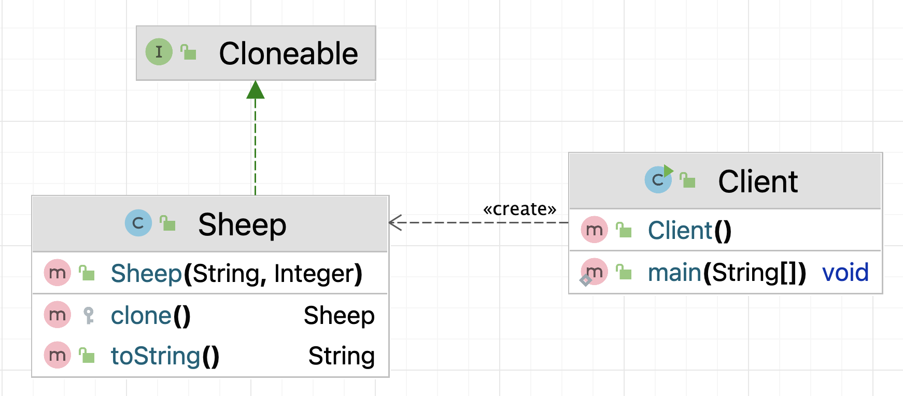
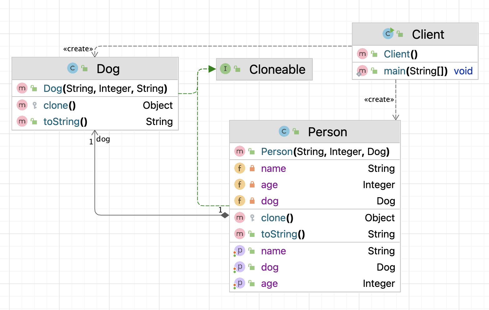
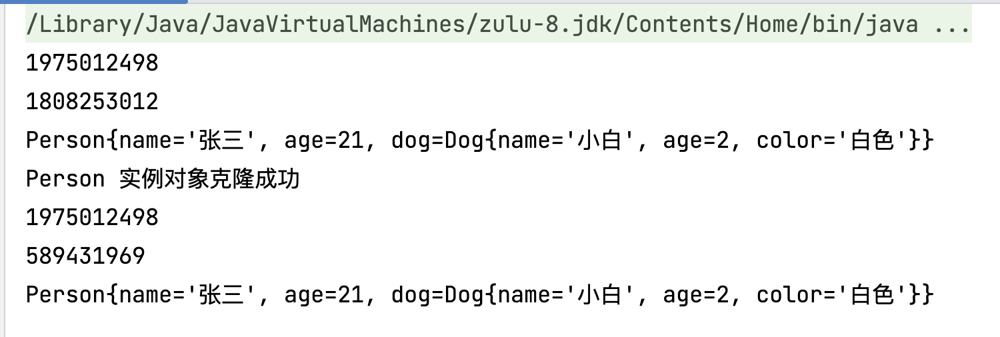
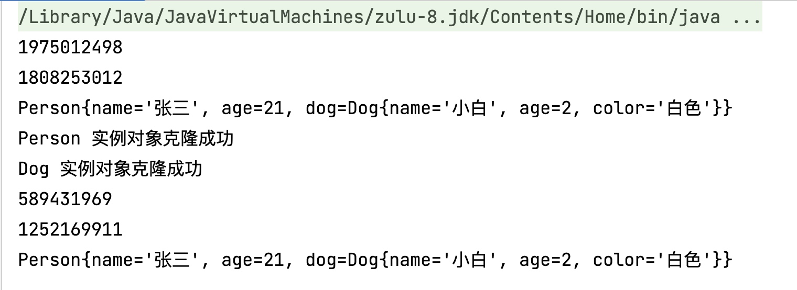

# 原型模式（Prototype）

## 一、简介

### 1.1 概述

用一个已经创建的实例作为原型，通过复制该原型对象来创建一个和原型对象相同的新对象。

### 1.2 原型模式结构

原型模式包含如下角色：

* 抽象原型类：规定了具体原型对象必须实现的的 clone() 方法。
* 具体原型类：实现抽象原型类的 clone() 方法，它是可被复制的对象。
* 访问类：使用具体原型类中的 clone() 方法来复制新的对象。

## 二、原型模式实现

### 2.1 案例1

案例说明：克隆羊

#### 类图



#### 代码实现

具体原型类

Sheep类：

```java
// Sheep 羊类
public class Sheep implements Cloneable {

    private String name;

    private Integer age;

    public Sheep(String name, Integer age) {
        this.name = name;
        this.age = age;
    }

    /**
     * 重写Cloneable接口的clone()方法
     *
     * @return Sheep类实例对象
     * @throws CloneNotSupportedException 不支持克隆异常
     */
    @Override
    protected Sheep clone() throws CloneNotSupportedException {
        System.out.println("具体的原型对象创建完成!");
        return (Sheep) super.clone();
    }

    @Override
    public String toString() {
        return "Sheep{" +
                "name='" + name + '\'' +
                ", age=" + age +
                '}';
    }
}
```

客户端（使用方或者称为调用方）

```java
// Client 客户端
public class Client {
    public static void main(String[] args) throws CloneNotSupportedException {
        // sheep就是原型
        Sheep sheep = new Sheep("多利", 3);
        System.out.println(sheep);
        // 开始克隆
        Sheep sheep1 = sheep.clone();
        System.out.println(sheep1);
        // 对比一下hashCode值，看两个对象指向堆内存的地址指针是否是同一个
        System.out.println(sheep.hashCode()); // 1975012498
        System.out.println(sheep1.hashCode()); // 1808253012
        // 对比hashCode值，证明克隆出来的是深拷贝
    }
}
```

### 2.2 案例2

案例说明：张三有一只小狗叫小白，然后使用原型模式克隆一个一摸一样的张三和小白。

#### 类图



#### 代码实现

具体原型类

Person类：

```java
// Person 人类
public class Person implements Cloneable {

    private String name;

    private Integer age;

    private Dog dog;
    
    // 有参数构造方法
    public Person(String name, Integer age, Dog dog) {
        this.name = name;
        this.age = age;
        this.dog = dog;
    }

    // set/get方法
    public String getName() {
        return name;
    }

    public void setName(String name) {
        this.name = name;
    }

    public Integer getAge() {
        return age;
    }

    public void setAge(Integer age) {
        this.age = age;
    }

    public Dog getDog() {
        return dog;
    }

    public void setDog(Dog dog) {
        this.dog = dog;
    }

    // 重写 clone()方法
    @Override
    protected Object clone() throws CloneNotSupportedException {
        System.out.println("Person 实例对象克隆成功");
        return super.clone();
    }

    // 重写 toString方法
    @Override
    public String toString() {
        return "Person{" +
                "name='" + name + '\'' +
                ", age=" + age +
                ", dog=" + dog +
                '}';
    }
}
```

Dog类：

```java
// Dog 小狗类
public class Dog implements Cloneable {

    private String name;

    private Integer age;

    private String color;

    // 有参数构造方法
    public Dog(String name, Integer age, String color) {
        this.name = name;
        this.age = age;
        this.color = color;
    }

    // 重写 clone()方法
    @Override
    protected Object clone() throws CloneNotSupportedException {
        System.out.println("Dog 实例对象克隆成功");
        return super.clone();
    }

    // 重写 toString方法
    @Override
    public String toString() {
        return "Dog{" +
                "name='" + name + '\'' +
                ", age=" + age +
                ", color='" + color + '\'' +
                '}';
    }
}
```

客户端（使用方或者称为调用方）

```java
// 客户端 Client
public class Client {
    public static void main(String[] args) throws CloneNotSupportedException {
        Dog dog1 = new Dog("小白", 2, "白色");
        System.out.println(dog1.hashCode()); // 1975012498
        Person p1 = new Person("张三", 21, dog1);
        System.out.println(p1.hashCode()); // 1808253012
        System.out.println(p1);

        // 克隆
        Person p2 = (Person) p1.clone();
        Dog dog2 = p2.getDog();
        System.out.println(dog2.hashCode()); // 1975012498
        System.out.println(p2.hashCode()); // 589431969
        // 由此可见，对于引用数据类型是浅拷贝
        System.out.println(p2);
    }
}
```

运行结果



由此可见通过p1对象克隆出来的张三也就是p2是属于深拷贝，但是张三的小狗小白还是原来的具体原型对象p1的小狗dog1，由此可见对于引用数据类型默认使用的是浅拷贝。

修改Person类重写的`clone()`方法

```java
public class Person implements Cloneable {

    private String name;

    private Integer age;

    private Dog dog;

    // 构造方法
    public Person(String name, Integer age, Dog dog) {
        this.name = name;
        this.age = age;
        this.dog = dog;
    }

    // set/get方法
    public String getName() {
        return name;
    }

    public void setName(String name) {
        this.name = name;
    }

    public Integer getAge() {
        return age;
    }

    public void setAge(Integer age) {
        this.age = age;
    }

    public Dog getDog() {
        return dog;
    }

    public void setDog(Dog dog) {
        this.dog = dog;
    }

    // 重写 clone()方法
    @Override
    protected Object clone() throws CloneNotSupportedException {
        System.out.println("Person 实例对象克隆成功");
        Person person = (Person) super.clone();
        person.dog = (Dog) person.dog.clone();
        return person;
    }

    // 重写 toString方法
    @Override
    public String toString() {
        return "Person{" +
                "name='" + name + '\'' +
                ", age=" + age +
                ", dog=" + dog +
                '}';
    }
}
```

此时的运行结果，拷贝出来的Dog实例对象就不是使用同一个地址。



## 三、原型模式使用场景

原型模式使用场景如下：

* 对象的创建非常复杂，可以使用原型模式快捷的创建对象。
* 性能和安全要求比较高。