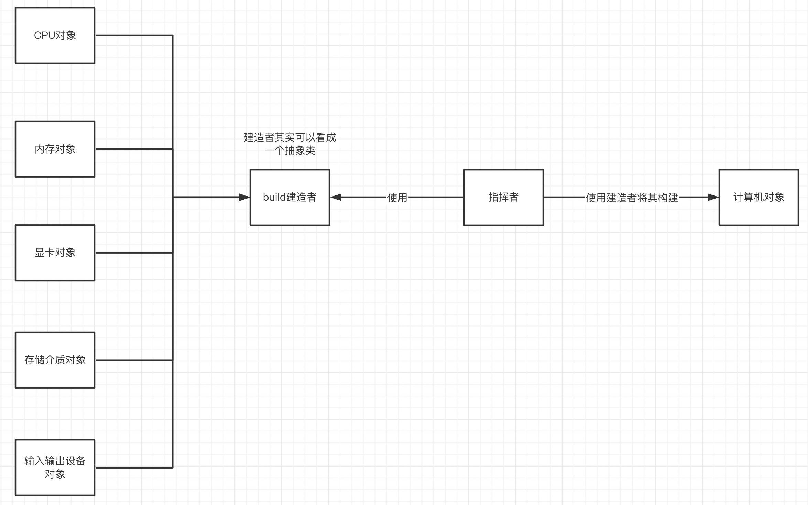
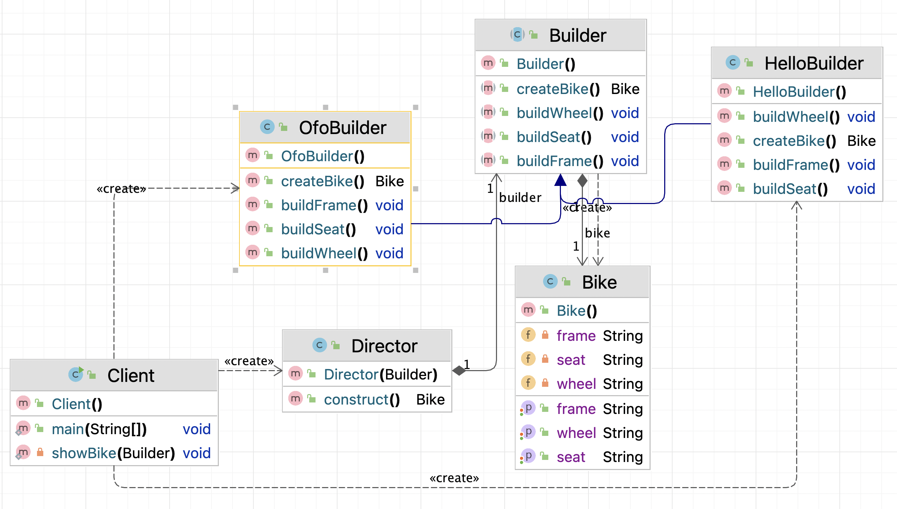
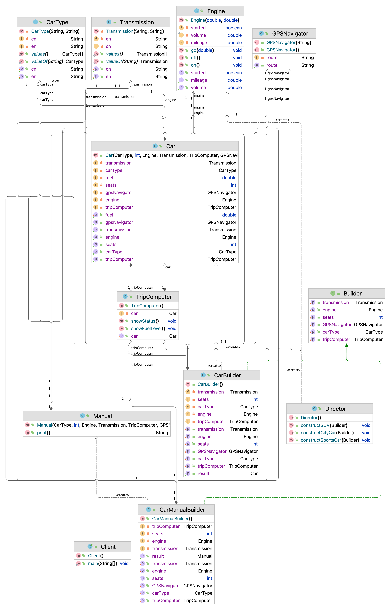
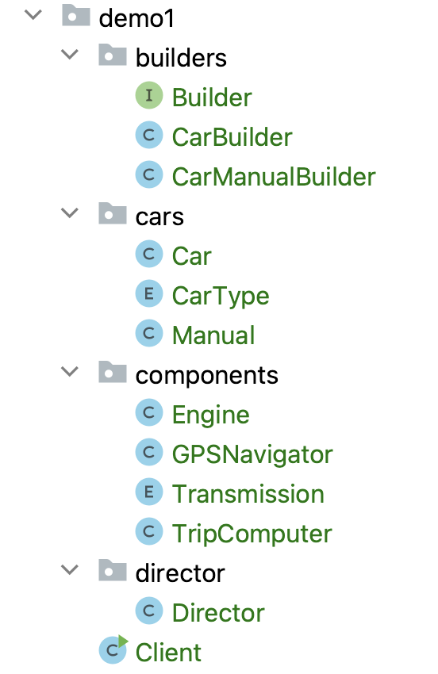

# 建造者模式（Builder）

# 一、简介

## 1.1 建造者模式概述

建造者模式又称为构建者模式。

将一个复杂对象的构建与表示分离，使得同样的构建过程可以创建不同的表示。




- 分离了部件的构造(由Builder来负责)和装配(由Director负责)。 从而可以构造出复杂的对象。这个模式适用于：某个对象的构建过程复杂的情况。
- 由于实现了构建和装配的解耦。不同的构建器，相同的装配，也可以做出不同的对象；相同的构建器，不同的装配顺序也可以做出不同的对象。也就是实现了构建算法、装配算法的解耦，实现了更好的复用。
- 建造者模式可以将部件和其组装过程分开，一步一步创建一个复杂的对象。用户只需要指定复杂对象的类型就可以得到该对象，而无须知道其内部的具体构造细节。

## 1.2 建造者模式结构

建造者（Builder）模式包含如下角色：

* 抽象建造者类（Builder）：这个接口规定要实现复杂对象的那些部分的创建，并不涉及具体的部件对象的创建。 

* 具体建造者类（ConcreteBuilder）：实现 Builder 接口，完成复杂产品的各个部件的具体创建方法。在构造过程完成后，提供产品的实例。 

* 产品类（Product）：要创建的复杂对象。

* 指挥者类（Director）：调用具体建造者来创建复杂对象的各个部分，在指导者中不涉及具体产品的信息，只负责保证对象各部分完整创建或按某种顺序创建。 

# 二、建造者模式实现

## 2.1 案例1

生产自行车是一个复杂的过程，它包含了车架，车座等组件的生产。而车架又有碳纤维，铝合金等材质的，车座有橡胶，真皮等材质。对于自行车的生产就可以使用建造者模式。

这里Bike是产品，包含车架，车座等组件；Builder是抽象建造者，MobikeBuilder和OfoBuilder是具体的建造者；Director是指挥者。类图如下：

### 类图



### 实现代码

抽象构建者

Builder类：

```java
// Builder 抽象构建者
public abstract class Builder {

    // 定义一个具体产品类成员变量
    protected Bike bike = new Bike();

    // 构建自行车架子
    public abstract void buildFrame();

    // 自行车座
    public abstract void buildSeat();

    // 自行车轮胎
    public abstract void buildWheel();

    // 构建自行车
    public abstract Bike createBike();
}
```

具体构建者

HelloBuilder类：

```java
// HelloBuilder 哈罗自行车构建者类
public class HelloBuilder extends Builder {
    @Override
    public void buildFrame() {
        bike.setFrame("碳纤维车架");
    }

    @Override
    public void buildSeat() {
        bike.setSeat("碳纤维座椅");
    }

    @Override
    public void buildWheel() {
        bike.setWheel("高级轮胎");
    }

    @Override
    public Bike createBike() {
        return bike;
    }
}
```

OfoBuilder类：

```java
// OfoBuilder ofo自行车构建者类
public class OfoBuilder extends Builder {

    @Override
    public void buildFrame() {
        bike.setFrame("橡胶车架");
    }

    @Override
    public void buildSeat() {
        bike.setSeat("橡胶座椅");
    }

    @Override
    public void buildWheel() {
        bike.setWheel("中级轮胎");
    }

    @Override
    public Bike createBike() {
        return bike;
    }
}
```

指挥者

Director类：

```java
// Director 指挥者（建筑师）
public class Director {

    private Builder builder;

    public Director(Builder builder) {
        this.builder = builder;
    }

    /**
     * 用于构建复杂对象
     * @return
     */
    public Bike construct() {
        builder.buildFrame();
        builder.buildSeat();
        builder.buildWheel();
        return builder.createBike();
    }
}
```

客户端（使用方或者称为调用方）

```java
// Client 客户端
public class Client {
    public static void main(String[] args) {
        showBike(new OfoBuilder());
        showBike(new HelloBuilder());
    }

    private static void showBike(Builder builder) {
        Director director = new Director(builder);
        Bike bike = director.construct();
        System.out.println(bike.getFrame());
        System.out.println(bike.getSeat());
        System.out.println(bike.getWheel());
    }
}
```

## 2.1 案例2

案例中，使用建造者模式允许你分步骤地制造不同型号的汽车。

示例还展示了生成器如何使用相同的生产过程制造不同类型的产品 （汽车手册）。

主管控制着构造顺序。 它知道制造各种汽车型号需要调用的生产步骤。 它仅与汽车的通用接口进行交互。 这样就能将不同类型的生成器传递给主管了。

最终结果将从生成器对象中获得， 因为主管不知道最终产品的类型。 只有生成器对象知道自己生成的产品是什么。

### 类图



### 实现代码

目录结构如下：



抽象建造者

Builder类：

```java
package demo1.builders;

import demo1.cars.CarType;
import demo1.components.Engine;
import demo1.components.GPSNavigator;
import demo1.components.Transmission;
import demo1.components.TripComputer;

/**
 * @Author: Matrix
 * @Date: 2022-09-16 20:28:17
 * @Version: v1.0.0
 * @Description: 通用生成器接口
 */
public interface Builder {

    /** 汽车类型 */
    void setCarType(CarType type);

    /** 汽车多少个座位 */
    void setSeats(int seats);

    /** 汽车引擎 */
    void setEngine(Engine engine);

    /** 汽车变速器 */
    void setTransmission(Transmission transmission);

    /** 汽车仪表盘 */
    void setTripComputer(TripComputer tripComputer);

    /** GPS导航器 */
    void setGPSNavigator(GPSNavigator gpsNavigator);
}
```

具体建造者

CarBuilder类：

```java
package demo1.builders;

import demo1.cars.Car;
import demo1.cars.CarType;
import demo1.components.Engine;
import demo1.components.GPSNavigator;
import demo1.components.Transmission;
import demo1.components.TripComputer;

/**
 * @Author: Matrix
 * @Date: 2022-09-16 20:34:45
 * @Version: v1.0.0
 * @Description: 汽车生产器
 */
public class CarBuilder implements Builder {

    /** 汽车类型 */
    private CarType carType;

    /** 汽车多少个座位 */
    private int seats;

    /** 汽车引擎 */
    private Engine engine;

    /** 汽车变速器 */
    private Transmission transmission;

    /** 汽车仪表盘 */
    private TripComputer tripComputer;

    /** GPS导航器 */
    private GPSNavigator gpsNavigator;


    public void setCarType(CarType carType) {
        this.carType = carType;
    }

    @Override
    public void setSeats(int seats) {
        this.seats = seats;
    }

    @Override
    public void setEngine(Engine engine) {
        this.engine = engine;
    }

    @Override
    public void setTransmission(Transmission transmission) {
        this.transmission = transmission;
    }

    @Override
    public void setTripComputer(TripComputer tripComputer) {
        this.tripComputer = tripComputer;
    }

    @Override
    public void setGPSNavigator(GPSNavigator gpsNavigator) {
        this.gpsNavigator = gpsNavigator;
    }

    public Car getResult() {
        return new Car(carType, seats, engine, transmission, tripComputer, gpsNavigator);
    }
}
```

CarManualBuilder类：

```java
package demo1.builders;

import demo1.cars.CarType;
import demo1.cars.Manual;
import demo1.components.Engine;
import demo1.components.GPSNavigator;
import demo1.components.Transmission;
import demo1.components.TripComputer;

/**
 * @Author: Matrix
 * @Date: 2022-09-16 20:37:45
 * @Version: v1.0.0
 * @Description: 汽车手册生成器
 */
public class CarManualBuilder implements Builder {

    /** 汽车类型 */
    private CarType type;

    /** 汽车多少个座位 */
    private int seats;

    /** 汽车引擎 */
    private Engine engine;

    /** 汽车变速器 */
    private Transmission transmission;

    /** 汽车仪表盘 */
    private TripComputer tripComputer;

    /** GPS导航器 */
    private GPSNavigator gpsNavigator;

    @Override
    public void setCarType(CarType type) {
        this.type = type;
    }

    @Override
    public void setSeats(int seats) {
        this.seats = seats;
    }

    @Override
    public void setEngine(Engine engine) {
        this.engine = engine;
    }

    @Override
    public void setTransmission(Transmission transmission) {
        this.transmission = transmission;
    }

    @Override
    public void setTripComputer(TripComputer tripComputer) {
        this.tripComputer = tripComputer;
    }

    @Override
    public void setGPSNavigator(GPSNavigator gpsNavigator) {
        this.gpsNavigator = gpsNavigator;
    }

    public Manual getResult() {
        return new Manual(type, seats, engine, transmission, tripComputer, gpsNavigator);
    }
}
```

复杂的产品

Car类：

```java
package demo1.cars;

import demo1.components.Engine;
import demo1.components.GPSNavigator;
import demo1.components.Transmission;
import demo1.components.TripComputer;

/**
 * @Author: Matrix
 * @Date: 2022-09-16 20:38:55
 * @Version: v1.0.0
 * @Description: 汽车产品
 */
public class Car {

    /** 汽车类型 */
    private CarType carType;

    /** 汽车多少个座位 */
    private int seats;

    /** 汽车引擎 */
    private Engine engine;

    /** 汽车变速器 */
    private Transmission transmission;

    /** 汽车仪表盘 */
    private TripComputer tripComputer;

    /** GPS导航器 */
    private GPSNavigator gpsNavigator;

    /** 燃料 */
    private double fuel = 0;

    /**
     * 构造初始化汽车产品对象
     *
     * @param carType
     * @param seats
     * @param engine
     * @param transmission
     * @param tripComputer
     * @param gpsNavigator
     */
    public Car(CarType carType, int seats, Engine engine, Transmission transmission,
               TripComputer tripComputer, GPSNavigator gpsNavigator) {
        this.carType = carType;
        this.seats = seats;
        this.engine = engine;
        this.transmission = transmission;
        this.tripComputer = tripComputer;
        if (this.tripComputer != null) {
            this.tripComputer.setCar(this);
        }
        this.gpsNavigator = gpsNavigator;
    }

    public CarType getCarType() {
        return carType;
    }

    public double getFuel() {
        return fuel;
    }

    public void setFuel(double fuel) {
        this.fuel = fuel;
    }

    public int getSeats() {
        return seats;
    }

    public Engine getEngine() {
        return engine;
    }

    public Transmission getTransmission() {
        return transmission;
    }

    public TripComputer getTripComputer() {
        return tripComputer;
    }

    public GPSNavigator getGpsNavigator() {
        return gpsNavigator;
    }
}
```

CarType枚举类：

```java
package demo1.cars;

/**
 * @Author: Matrix
 * @Date: 2022-09-16 20:44:58
 * @Version: v1.0.0
 * @Description: 汽车类型
 */
public enum CarType {

    // 城市汽车
    CITY_CAR("CITY_CAR", "城市汽车"),

    // 跑车
    SPORTS_CAR("SPORTS_CAR", "跑车"),

    // 运动型多用途汽车
    SUV("SUV", "运动型多用途汽车");

    // 英文
    private String en;

    // 简体中文
    private String cn;

    // 构造赋值枚举变量
    CarType(String en, String cn) {
        this.en = en;
        this.cn = cn;
    }

    public String getEn() {
        return en;
    }

    public void setEn(String en) {
        this.en = en;
    }

    public String getCn() {
        return cn;
    }

    public void setCn(String cn) {
        this.cn = cn;
    }
}
```

Manual类：

```java
package demo1.cars;

import demo1.components.Engine;
import demo1.components.GPSNavigator;
import demo1.components.Transmission;
import demo1.components.TripComputer;

/**
 * @Author: Matrix
 * @Date: 2022-09-16 20:41:57
 * @Version: v1.0.0
 * @Description: 手册产品
 */
public class Manual {

    /** 汽车类型 */
    private CarType carType;

    /** 汽车多少个座位 */
    private int seats;

    /** 汽车引擎 */
    private Engine engine;

    /** 汽车变速器 */
    private Transmission transmission;

    /** 汽车仪表盘 */
    private TripComputer tripComputer;

    /** GPS导航 */
    private GPSNavigator gpsNavigator;

    /**
     * 构造初始化对象
     *
     * @param carType
     * @param seats
     * @param engine
     * @param transmission
     * @param tripComputer
     * @param gpsNavigator
     */
    public Manual(CarType carType, int seats, Engine engine, Transmission transmission,
                  TripComputer tripComputer, GPSNavigator gpsNavigator) {
        this.carType = carType;
        this.seats = seats;
        this.engine = engine;
        this.transmission = transmission;
        this.tripComputer = tripComputer;
        this.gpsNavigator = gpsNavigator;
    }

    /**
     * 输出基本信息
     *
     * @return
     */
    public String print() {
        String info = "";
        info += "汽车类型: " + carType.getCn() + "\n";
        info += "座位数: " + seats + "\n";
        info += "汽车引擎: 体积 - " + engine.getVolume() + "; 里程数 - " + engine.getMileage() + "\n";
        info += "变数箱: " + transmission.getCn() + "\n";
        if (this.tripComputer != null) {
            info += "汽车仪表盘：功能正常" + "\n";
        } else {
            info += "汽车仪表盘：不适用" + "\n";
        }
        if (this.gpsNavigator != null) {
            info += "GPS导航器：功能正常" + "\n";
        } else {
            info += "GPS导航器: 不适用" + "\n";
        }
        return info;
    }
}
```

组件，用于构建成复杂的产品对象

Engine类：

```java
package demo1.components;

/**
 * @Author: Matrix
 * @Date: 2022-09-16 20:47:12
 * @Version: v1.0.0
 * @Description: 汽车引擎
 */
public class Engine {

    /** 体积 */
    private final double volume;

    /** 里程 */
    private double mileage;

    /** 启动 */
    private boolean started;

    public Engine(double volume, double mileage) {
        this.volume = volume;
        this.mileage = mileage;
    }

    public void on() {
        started = true;
    }

    public void off() {
        started = false;
    }

    public boolean isStarted() {
        return started;
    }

    public void go(double mileage) {
        if (started) {
            this.mileage += mileage;
        } else {
            System.err.println("无法转到（），必须先启动发动机！");
        }
    }

    public double getVolume() {
        return volume;
    }

    public double getMileage() {
        return mileage;
    }
}
```

GPSNavigator类：

```java
package demo1.components;

/**
 * @Author: Matrix
 * @Date: 2022-09-16 20:49:35
 * @Version: v1.0.0
 * @Description: GPS导航器
 */
public class GPSNavigator {

    private String route;

    public GPSNavigator() {
        this.route = "地球村xxx街道xxx路xxx号";
    }

    public GPSNavigator(String manualRoute) {
        this.route = manualRoute;
    }

    public String getRoute() {
        return route;
    }
}
```

Transmission枚举类：

```java
package demo1.components;

/**
 * @Author: Matrix
 * @Date: 2022-09-16 20:51:06
 * @Version: v1.0.0
 * @Description: 变速器
 */
public enum Transmission {

    // 单速
    SINGLE_SPEED("SINGLE_SPEED", "单速"),

    // 手动
    MANUAL("MANUAL", "手动"),

    // 自动
    AUTOMATIC("AUTOMATIC", "自动"),

    // 半自动
    SEMI_AUTOMATIC("SEMI_AUTOMATIC", "半自动");

    // 英文
    private String en;

    // 简体中文
    private String cn;

    // 构造赋值枚举变量
    Transmission(String en, String cn) {
        this.en = en;
        this.cn = cn;
    }

    public String getEn() {
        return en;
    }

    public void setEn(String en) {
        this.en = en;
    }

    public String getCn() {
        return cn;
    }

    public void setCn(String cn) {
        this.cn = cn;
    }
}
```

TripComputer类：

```java
package demo1.components;

import demo1.cars.Car;

/**
 * @Author: Matrix
 * @Date: 2022-09-16 20:53:18
 * @Version: v1.0.0
 * @Description: 汽车仪表盘
 */
public class TripComputer {

    private Car car;

    public void setCar(Car car) {
        this.car = car;
    }

    public void showFuelLevel() {
        System.out.println("燃油油位：" + car.getFuel());
    }

    public void showStatus() {
        if (this.car.getEngine().isStarted()) {
            System.out.println("汽车启动了");
        } else {
            System.out.println("汽车未启动");
        }
    }
}
```

指挥者，构建复杂产品对象的建造工程狮

Director类：

```java
package demo1.director;

import demo1.builders.Builder;
import demo1.cars.CarType;
import demo1.components.Engine;
import demo1.components.GPSNavigator;
import demo1.components.Transmission;
import demo1.components.TripComputer;

/**
 * @Author: Matrix
 * @Date: 2022-09-16 20:57:35
 * @Version: v1.0.0
 * @Description: 主管控制生成器【建造者的建造工程狮】
 */
public class Director {

    /**
     * 制造跑车
     * @param builder 通用生成器接口
     */
    public void constructSportsCar(Builder builder) {
        builder.setCarType(CarType.SPORTS_CAR);
        builder.setSeats(2);
        builder.setEngine(new Engine(3.0, 0));
        builder.setTransmission(Transmission.SEMI_AUTOMATIC);
        builder.setTripComputer(new TripComputer());
        builder.setGPSNavigator(new GPSNavigator());
    }

    /**
     * 制造城市汽车
     * @param builder 通用生成器接口
     */
    public void constructCityCar(Builder builder) {
        builder.setCarType(CarType.CITY_CAR);
        builder.setSeats(2);
        builder.setEngine(new Engine(1.2, 0));
        builder.setTransmission(Transmission.AUTOMATIC);
        builder.setTripComputer(new TripComputer());
        builder.setGPSNavigator(new GPSNavigator());
    }

    /**
     * 制造运动型多用途汽车
     *
     * @param builder 通用生成器接口
     */
    public void constructSUV(Builder builder) {
        builder.setCarType(CarType.SUV);
        builder.setSeats(4);
        builder.setEngine(new Engine(2.5, 0));
        builder.setTransmission(Transmission.MANUAL);
        builder.setGPSNavigator(new GPSNavigator());
    }
}
```

客户端（使用方或者称为调用方）

```java
package demo1;

import demo1.builders.CarBuilder;
import demo1.builders.CarManualBuilder;
import demo1.cars.Car;
import demo1.cars.Manual;
import demo1.director.Director;

/**
 * @Author: Matrix
 * @Date: 2022-09-16 21:00:42
 * @Version: v1.0.0
 * @Description: 客户端（使用方或者称为调用方）
 */
public class Client {
    public static void main(String[] args) {
        // 创建一个主管控制生成器【建造者的建造工程狮】
        Director director = new Director();

        // Director从客户端获取具体的生成器对象
        // （应用程序代码）。这是因为应用程序更清楚哪些
        // 用于获取特定产品的生成器。
        CarBuilder builder = new CarBuilder();
        director.constructSportsCar(builder);

        // 最终产品通常从构建器对象【Builder具体实现类对象】中检索
        // 因为建造者的建造工程狮不知道也不依赖于混凝土建筑商，以及产品。
        Car car = builder.getResult();
        System.out.println("汽车构建中【制造中】:\n" + car.getCarType().getCn());


        CarManualBuilder manualBuilder = new CarManualBuilder();

        // 建造者的建造工程狮可能知道一些建筑配方。
        director.constructSportsCar(manualBuilder);
        Manual carManual = manualBuilder.getResult();
        System.out.println("\n汽车说明书构建者中【制造中】:\n" + carManual.print());
    }
}
```

# 三、建造者模式总结

**优点：**

- 建造者模式的封装性很好。使用建造者模式可以有效的封装变化，在使用建造者模式的场景中，一般产品类和建造者类是比较稳定的，因此，将主要的业务逻辑封装在指挥者类中对整体而言可以取得比较好的稳定性。
- 在建造者模式中，客户端不必知道产品内部组成的细节，将产品本身与产品的创建过程解耦，使得相同的创建过程可以创建不同的产品对象。
- 可以更加精细地控制产品的创建过程 。将复杂产品的创建步骤分解在不同的方法中，使得创建过程更加清晰，也更方便使用程序来控制创建过程。
- 建造者模式很容易进行扩展。如果有新的需求，通过实现一个新的建造者类就可以完成，基本上不用修改之前已经测试通过的代码，因此也就不会对原有功能引入风险。符合开闭原则。

**缺点：**

- 造者模式所创建的产品一般具有较多的共同点，其组成部分相似，如果产品之间的差异性很大，则不适合使用建造者模式，因此其使用范围受到一定的限制。

# 四、建造者模式使用场景

建造者（Builder）模式创建的是复杂对象，其产品的各个部分经常面临着剧烈的变化，但将它们组合在一起的算法却相对稳定，所以它通常在以下场合使用。

- 创建的对象较复杂，由多个部件构成，各部件面临着复杂的变化，但构件间的建造顺序是稳定的。
- 创建复杂对象的算法独立于该对象的组成部分以及它们的装配方式，即产品的构建过程和最终的表示是独立的。

